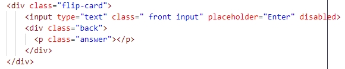
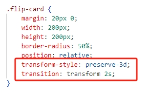
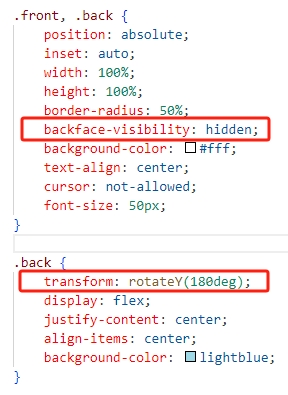
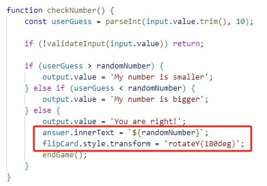

# Tutorial: How to create an animation that flips a graphic?
  

    In some games, we sometimes want to add animation to make the game's interactive interface more interesting. In this tutorial, I will teach you how to make a flippable graphic. My tutorial is based on a classic number guessing game. Players fill in the guessed number on the front of a graphic. When the player guesses correctly, the graphic will flip and show the correct answer on the back.
  

## Step 1
   

     First, you need to create a graphic(flip-card) in your HTML file. This graphic contains two elements, the front element is used to input numbers, and the back element is used to display the answer. The code is as shown below:
   

   &nbsp;

## Step 2
   

     Set up flip-card style in your CSS file. One of the key parameters is transform-style: preserve-3d, It preserves the 3D effects on the front and back sides of the card, allowing them to flip smoothly when triggered. Another key parameter is transition: transform 2s, which sets the time taken for the flip. The code is as follows:
   

   &nbsp;

## Step 3
   

     Then set the styles of the child elements (front & back) in the CSS file. An important parameter they share is backface-visibility: hidden, which ensures that when the front or back is displayed, the other side is hidden. The element back also has another important parameter, transform: rotateY(180deg), This ensures that the back side of the card is hidden until the flip is triggered. The code is as follows:
   

   &nbsp;

## Step 4
   

      Finally, in your JS file, add the flip style to the trigger condition. In this case, the flip style is triggered when the player guesses the number correctly. The code is as follows:
   

   &nbsp;

## Link to the web page demo

   

     https://lucky-capybara-bf0bfa.netlify.app
   

